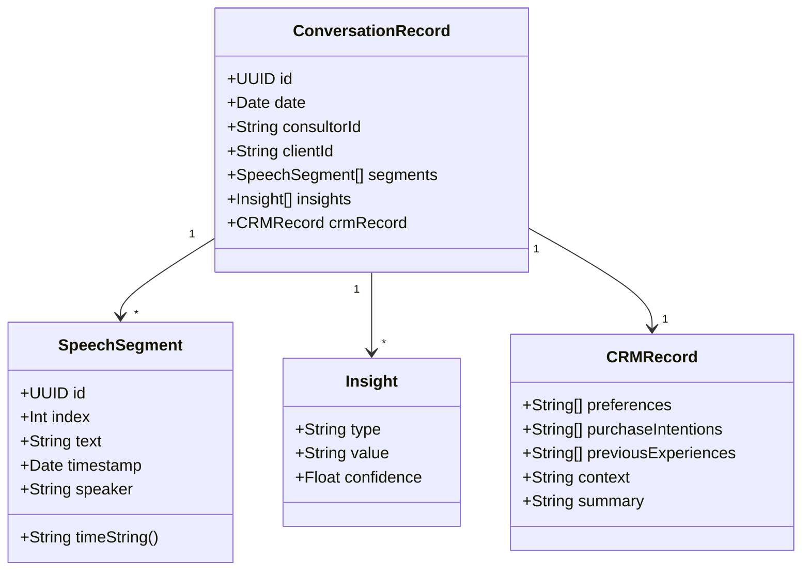

# Diagrama 3 — Modelo de Dados em RAM

```mermaid
classDiagram
    class SpeechSegment {
        +UUID id
        +Int index
        +String text
        +Date timestamp
        +String speaker
        +String timeString()
    }

    class ConversationRecord {
        +UUID id
        +Date date
        +String consultorId
        +String clientId
        +SpeechSegment[] segments
        +Insight[] insights
        +CRMRecord crmRecord
    }

    class Insight {
        +String type
        +String value
        +Float confidence
    }

    class CRMRecord {
        +String[] preferences
        +String[] purchaseIntentions
        +String[] previousExperiences
        +String context
        +String summary
    }

    ConversationRecord "1" --> "*" SpeechSegment
    ConversationRecord "1" --> "*" Insight
    ConversationRecord "1" --> "1" CRMRecord
```
