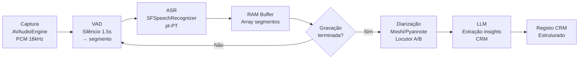

# Diagrama 4 — Pipeline de Processamento

```mermaid
flowchart LR
    A[Captura\nAVAudioEngine\nPCM 16kHz] --> B[VAD\nSilêncio 1.5s\n→ segmento]
    B --> C[ASR\nSFSpeechRecognizer\npt-PT]
    C --> D[RAM Buffer\nArray segmentos]
    D --> E{Gravação\nterminada?}
    E -->|Não| B
    E -->|Sim| F[Diarização\nMoshi/Pyannote\nLocutor A/B]
    F --> G[LLM\nExtração insights\nCRM]
    G --> H[Registo CRM\nEstruturado]
```
