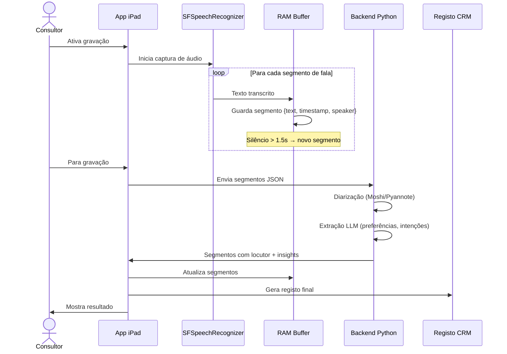

# Diagrama 2 — Sequência de uma Interação

```mermaid
sequenceDiagram
    actor C as Consultor
    participant App as App iPad
    participant ASR as SFSpeechRecognizer
    participant RAM as RAM Buffer
    participant BE as Backend Python
    participant CRM as Registo CRM

    C->>App: Ativa gravação
    App->>ASR: Inicia captura de áudio
    
    loop Para cada segmento de fala
        ASR->>RAM: Texto transcrito
        RAM->>RAM: Guarda segmento {text, timestamp, speaker}
        Note over RAM: Silêncio > 1.5s → novo segmento
    end

    C->>App: Para gravação
    App->>BE: Envia segmentos JSON
    BE->>BE: Diarização (Moshi/Pyannote)
    BE->>BE: Extração LLM (preferências, intenções)
    BE->>App: Segmentos com locutor + insights
    App->>RAM: Atualiza segmentos
    App->>CRM: Gera registo final
    App->>C: Mostra resultado
```
